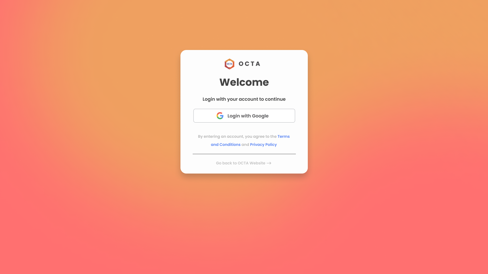
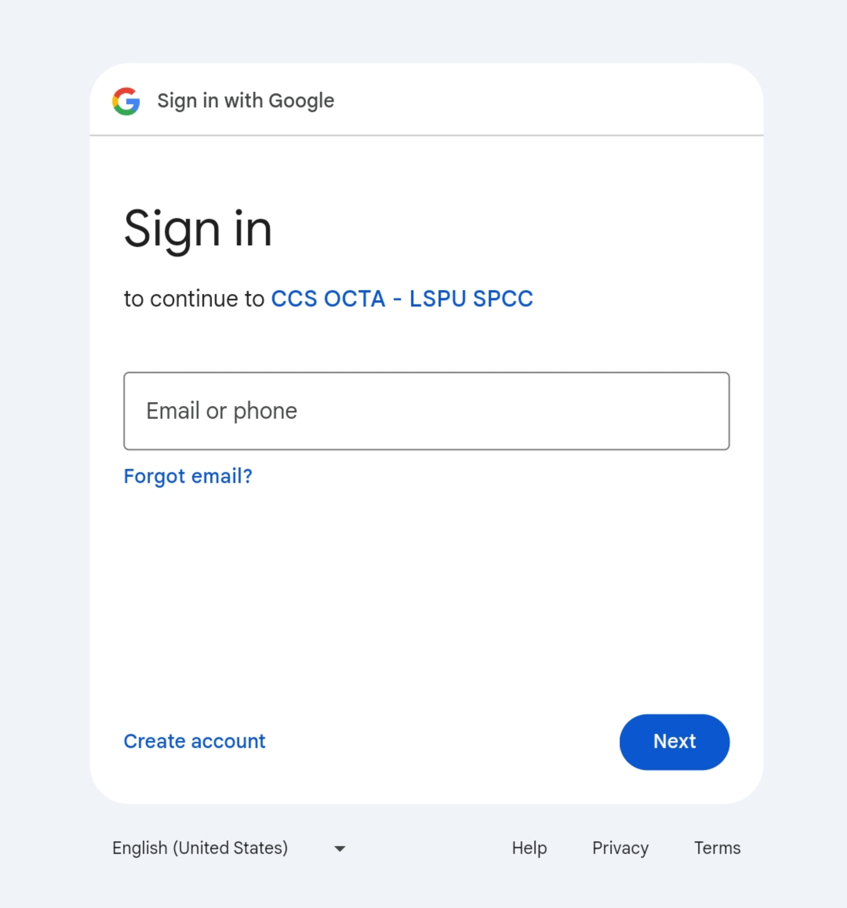

# CCS OCTA SERVER
***CCS OCTA - Backend Server***

> [!NOTE]
> See [Changelog](CHANGELOG.md).

<hr>

> [!IMPORTANT]
> All routes except for SSO routes are required with the `Authentication-Key` Header. Contact the developers to get one.

# Contents
- [Environments](#environments-case-sensitive)
- [User/Officer Roles](#user-roles)
  - [Everyone](#0---everyone)
  - [Super Admin](#1---super-admin)
  - [Administrator](#2---administrator)
  - [Trainor](#3---trainor)
  - [Publication](#4---publication)
- [Routes](#routes)
  - [SSO Routes](#sso-routes)
    - [Google Login](#google-login)
      - [Google Login Request](#google-login-request)
      - [Google Login Response](#google-login-response)
    - [Google Logout](#google-logout)
      - [Google Logout Request](#google-logout-request)
      - [Google Logout Response](#google-logout-response)
    - [Google Callback](#google-callback)
      - [Google Callback Request](#google-callback-request)
      - [Google Callback Response](#google-callback-response)
  - [Officer Routes](#officer-routes)
    - [Create Officer](#create-officer)
      - [Create Officer Request](#create-officer-request)
      - [Create Officer Response](#create-officer-response)
    - [Retrieve Officer](#retrieve-officer)
      - [Retrieve Officer Request](#retrieve-officer-request)
      - [Retrieve Officer Response](#retrieve-officer-response)
    - [Update Officer](#update-officer)
      - [Update Officer Request](#update-officer-request)
      - [Update Officer Response](#update-officer-response)
    - [Delete Officer](#delete-officer)
      - [Delete Officer Request](#delete-officer-request)
      - [Delete Officer Response](#delete-officer-response)
  - [Freedom Wall Post Routes](#freedom-wall-post-routes)
    - [Create Freedom Wall Post](#create-freedom-wall-post)
      - [Create Freedom Wall Post Request](#create-freedom-wall-post-request)
      - [Create Freedom Wall Post Response](#create-freedom-wall-post-response)
    - [Retrieve Freedom Wall Posts](#retrieve-freedom-wall-posts)
      - [Retrieve Freedom Wall Posts Request](#retrieve-freedom-wall-posts-request)
      - [Retrieve Freedom Wall Posts Response](#retrieve-freedom-wall-posts-response)
    - [Retrieve Freedom Wall Post](#retrieve-freedom-wall-post)
      - [Retrieve Freedom Wall Post Request](#retrieve-freedom-wall-post-request)
      - [Retrieve Freedom Wall Post Response](#retrieve-freedom-wall-post-response)
    - [Update Freedom Wall Post](#update-freedom-wall-post)
      - [Update Freedom Wall Post Request](#update-freedom-wall-post-request)
      - [Update Freedom Wall Post Response](#update-freedom-wall-post-response)
    - [Delete Freedom Wall Post](#delete-freedom-wall-post)
      - [Delete Freedom Wall Post Request](#delete-freedom-wall-post-request)
      - [Delete Freedom Wall Post Response](#delete-freedom-wall-post-response)

# Environments (Case Sensitive)
| Key | Description |
| --- | ----- |
| **PORT/port** | Hosting Port |
| **HOST** | MySql Host |
| **USER** | MySql User |
| **PASSWORD** | MySql Password |
| **DATABASE** | MySql Database |
| **AUTH_KEY** | Authorization Key |
| **SESSION_SECRET** | Session Secret |
| **GOOGLE_CLIENT_SECRET** | Client Secret |
| **GOOGLE_CLIENT_ID** | Client ID |
| **AKISMET_KEY** | Akismet API Key |
| **ROOT_URL** | Root URL |
| **FRONT_LOGIN_URL** | Frontend Login URL |
| **JWT_SECRET** | JWT Secret |

# User Roles
## 0 - Everyone
```json
{
  "canManageFreedomWallPosts": false,
  "canManageTutorials": false,
  "canManageNews": false,
  "canManageEvents": false,
  "canManageProjects": false,
  "canManageActivities": false,
  "canManageUsers": false
}
```
## 1 - Super Admin
```json
{
  "canManageFreedomWallPosts": true,
  "canManageTutorials": true,
  "canManageNews": true,
  "canManageEvents": true,
  "canManageProjects": true,
  "canManageActivities": true,
  "canManageUsers": true
}
```
## 2 - Administrator
```json
{
  "canManageFreedomWallPosts": true,
  "canManageTutorials": true,
  "canManageNews": true,
  "canManageEvents": true,
  "canManageProjects": true,
  "canManageActivities": true,
  "canManageUsers": false
}
```
## 3 - Trainor
```json
{
  "canManageFreedomWallPosts": true,
  "canManageTutorials": true,
  "canManageNews": false,
  "canManageEvents": false,
  "canManageProjects": false,
  "canManageActivities": true,
  "canManageUsers": false
}
```
## 4 - Publication
```json
{
  "canManageFreedomWallPosts": true,
  "canManageTutorials": false,
  "canManageNews": true,
  "canManageEvents": true,
  "canManageProjects": true,
  "canManageActivities": false,
  "canManageUsers": false
}
```


# Routes


## SSO Routes

### Google Login
If user is already logon, redirect to dashboard else redirect to login/signup page

#### Google Login Request
```js
GET /api/auth/login
```

#### Google Login Response
<kbd></kbd>
Or
<kbd></kbd>

<hr>

### Google Logout
Log out a user

#### Google Logout Request
```js
GET /api/auth/logout
```

#### Google Logout Response
<kbd></kbd>

<hr>

### Google Callback
Login/Signup with google

#### Google Callback Request
```js
GET /api/auth/google
```

#### Google Callback Response
<kbd></kbd>

<hr>

## Officer Routes

### Create Officer
Add a user to officers through email

#### Create Officer Request

```js
POST /api/officer/?email=&role=
```

```json
{
  "Authorization-Key": "AUTH_KEY"
}
```

#### Create Officer Response
```js
201 Created
```

```json
{
  "id": 1,
  "roleid": 1,
  "email_address": "0000-9999@lspu.edu.ph"
}
```

<hr>

### Retrieve Officer
Get someone's role permissions through email

#### Retrieve Officer Request

```js
GET /api/officer/?email=
```

```json
{
  "Authorization-Key": "AUTH_KEY"
}
```

#### Retrieve Officer Response
```js
200 Ok
```

```json
{
  "canManageFreedomWallPosts": false,
  "canManageTutorials": false,
  "canManageNews": false,
  "canManageEvents": false,
  "canManageProjects": false,
  "canManageActivities": false,
  "canManageUsers": false
}
```

<hr>

### Update Officer
Change an officers role through email

#### Update Officer Request

```js
PATCH /api/officer/?email=&role=
```

```json
{
  "Authorization-Key": "AUTH_KEY"
}
```

#### Update Officer Response
```js
200 Ok
```

```json
{
  "id": 1,
  "roleid": 2,
  "email_address": "0000-9999@lspu.edu.ph"
}
```

<hr>

### Delete Officer
Remove a user to officers through email

#### Delete Officer Request

```js
DELETE /api/officer/?email=
```

```json
{
  "Authorization-Key": "AUTH_KEY"
}
```

#### Delete Officer Response
```js
200 Ok
```

```json
{
  "message": "The user has been removed from officers."
}
```
or
```js
204 No Content
```

<hr>

## Freedom Wall Post Routes

### Create Freedom Wall Post
Add a user to officers through email

#### Create Freedom Wall Post Request

```js
POST /api/freedomwall/
```

```json
{
  "Authorization-Key": "AUTH_KEY"
}
```

```json
{
  "ToWhom": "Dev",
  "Message": "Lorem ipsum dolor sit amet, consectetur adipiscing elit. Mauris non gravida enim. In quis porttitor.",
  "Theme": 1,
  "Tags": [
    1, 2, 3
  ]
}
```

#### Create Freedom Wall Post Response
```js
201 Created
```

```json
{
  "id": 1,
  "ToWhom": "Dev",
  "Message": "Lorem ipsum dolor sit amet, consectetur adipiscing elit. Mauris non gravida enim. In quis porttitor.",
  "IsApproved": 0,
  "IsSpam": 0,
  "TimeStamp": "0000-00-00T00:00:00.000Z",
  "Tags": [
    "General",
    "Crushes",
    "Tech Idea"
  ],
  "Theme": {
    "name": "Light Peach",
    "hexcode": "#FFD9B2"
  }
}
```

<hr>

### Retrieve Freedom Wall Posts
Get all freedom wall posts

#### Retrieve Freedom Wall Posts Request

```js
GET /api/freedomwall/
```

```json
{
  "Authorization-Key": "AUTH_KEY"
}
```

#### Retrieve Freedom Wall Posts Response
```js
200 Ok
```

```json
[
  {
    "id": 1,
    "ToWhom": "Dev",
    "Message": "Lorem ipsum dolor sit amet, consectetur adipiscing elit. Mauris non gravida enim. In quis porttitor.",
    "IsApproved": 0,
    "IsSpam": 0,
    "TimeStamp": "0000-00-00T00:00:00.000Z",
    "Tags": [
      "General",
      "Crushes",
      "Tech Idea"
    ],
    "Theme": {
      "name": "Light Peach",
      "hexcode": "#FFD9B2"
    }
  },
  {
    "id": 2,
    "ToWhom": "User",
    "Message": "Lorem ipsum dolor sit amet, consectetur adipiscing elit. Mauris non gravida enim. In quis porttitor.",
    "IsApproved": 0,
    "IsSpam": 0,
    "TimeStamp": "0000-00-00T00:00:00.000Z",
    "Tags": [
      "Tech Idea",
      "Shoutout",
      "Question"
    ],
    "Theme": {
      "name": "Malibu",
      "hexcode": "#74D0EC"
    }
  }
]
```

<hr>

### Retrieve Freedom Wall Post
Get a specific freedom wall post

#### Retrieve Freedom Wall Post Request

```js
GET /api/freedomwall/:id
```

```json
{
  "Authorization-Key": "AUTH_KEY"
}
```

#### Retrieve Freedom Wall Post Response
```js
200 Ok
```

```json
{
  "id": 1,
  "ToWhom": "Dev",
  "Message": "Lorem ipsum dolor sit amet, consectetur adipiscing elit. Mauris non gravida enim. In quis porttitor.",
  "IsApproved": 0,
  "IsSpam": 0,
  "TimeStamp": "0000-00-00T00:00:00.000Z",
  "Tags": [
    "General",
    "Crushes",
    "Tech Idea"
  ],
  "Theme": {
    "name": "Light Peach",
    "hexcode": "#FFD9B2"
  }
}
```

<hr>

### Update Freedom Wall Post
Approve post/s by ID

#### Update Freedom Wall Post Request

```js
PATCH /api/freedomwall/
```

```json
{
  "Authorization-Key": "AUTH_KEY"
}
```

```json
{
  "ids": [
    1, 2
  ]
}
```

#### Update Freedom Wall Post Response
```js
200 Ok
```

```json
[
  {
    "id": 1,
    "ToWhom": "Dev",
    "Message": "Lorem ipsum dolor sit amet, consectetur adipiscing elit. Mauris non gravida enim. In quis porttitor.",
    "IsApproved": 1,
    "IsSpam": 0,
    "TimeStamp": "0000-00-00T00:00:00.000Z",
    "Tags": [
      "General",
      "Crushes",
      "Tech Idea"
    ],
    "Theme": {
      "name": "Light Peach",
      "hexcode": "#FFD9B2"
    }
  },
  {
    "id": 2,
    "ToWhom": "User",
    "Message": "Lorem ipsum dolor sit amet, consectetur adipiscing elit. Mauris non gravida enim. In quis porttitor.",
    "IsApproved": 1,
    "IsSpam": 0,
    "TimeStamp": "0000-00-00T00:00:00.000Z",
    "Tags": [
      "Tech Idea",
      "Shoutout",
      "Question"
    ],
    "Theme": {
      "name": "Malibu",
      "hexcode": "#74D0EC"
    }
  }
]
```

<hr>

### Delete Freedom Wall Post
Delete post/s by ID

#### Delete Freedom Wall Post Request

```js
POST /api/freedomwall/delete
```

```json
{
  "Authorization-Key": "AUTH_KEY"
}
```

```json
{
  "ids": [
    1, 2
  ]
}
```

#### Delete Freedom Wall Post Response
```js
200 Ok
```

```json
{
  "message": "Post/s has/have been deleted successfully!"
}
```
or
```js
204 No Content
```

<hr>